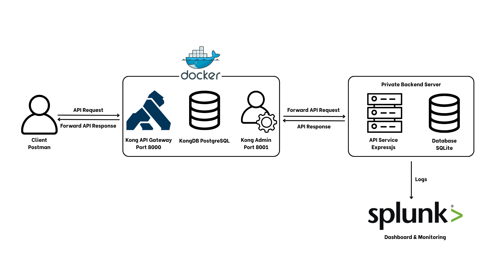

# API Security with Kong

This project demonstrates essential API security concepts using **Express** and **Kong Gateway**. It provides a hands-on exploration of modern API protection techniques, helping you understand and visualize secure API flows.

---

## Architecture



## Features Implemented

| Feature                             | Description                                                    | Status   |
| ----------------------------------- | -------------------------------------------------------------- | -------- |
| **CORS Configuration**              | Restricts API access to trusted origins for enhanced security. | Complete |
| **API Key Authentication**          | Secures endpoints by requiring valid API keys.                 | Complete |
| **JWT Authentication**              | Implements session management using JSON Web Tokens.           | Complete |
| **Rate Limiting**                   | Protects APIs from abuse by limiting request rates.            | Complete |
| **Input Validation & Sanitization** | Ensures incoming data is safe and well-formed.                 |          |
| **API Activity Logging**            | Monitors and analyzes API usage for better observability.      |          |

---

## Getting Started

As the maintainer of this repository, I recommend following these steps to set up and run the project from scratch, even if you have not installed any dependencies or cloned the repository yet.

### 1. Prerequisites

- **Node.js** (v18+ recommended) and **npm**  
  [Download Node.js](https://nodejs.org/)
- **Docker Desktop** & **Docker Compose**  
  [Download Docker Desktop](https://www.docker.com/products/docker-desktop/)
- **decK** (Kong declarative configuration tool)  
  [Download decK](https://github.com/kong/deck/releases)
- **Git**  
  [Download Git](https://git-scm.com/)

---

### 2. Clone the Repository

```sh
git clone https://github.com/Neit272/API-Security-with-API-Gateway-Management.git
cd API-Security-with-API-Gateway-Management
```

---

### 3. Start Kong Gateway and Database with Docker

```sh
docker compose up -d
```

Wait a few minutes for both `kong-db` and `kong` containers to fully start.

**If this is your first time running Kong with a new database, you must bootstrap the database:**

```sh
docker compose run --rm kong kong migrations bootstrap
docker compose up -d
```

---

### 4. Install Node.js Server Dependencies

```sh
npm install
```

---

### 5. Configure Environment Variables

Copy the example environment file and adjust if needed:

```sh
cp .env.example .env
```

_(On Windows CMD: `copy .env.example .env`)_

Check the variables in `.env` (the defaults are suitable for local development).

---

### 6. Sync Kong Configuration with decK

Make sure you're in "Kong Gateway Configuration" directory.

```sh
deck gateway sync kong.yaml
```

If you encounter schema errors, please review your YAML file as described above.

---

### 7. Start the Node.js API Server

```sh
npm start
```

Or for development (auto-reload on code changes):

```sh
npm run dev
```

The API server will be available at: [http://localhost:4000](http://localhost:4000)

---

### 8. Access the Dashboard and Try Out Features

- **Web Dashboard:**  
  [http://localhost:4000/dashboard](http://localhost:4000/dashboard)
- Register, log in, obtain JWT, refresh tokens, get API keys, etc.

---

### 9. Send Requests via Kong Gateway

All API requests should go through Kong (port 8000):

- `http://localhost:8000/api/public/info`
- `http://localhost:8000/api/key/info` (requires API key)
- `http://localhost:8000/api/jwt/info` (requires JWT)

---

### 10. (Optional) Kong Administration

- **Kong Admin API:**  
  [http://localhost:8001](http://localhost:8001)
- **Kong Manager GUI:**  
  [http://localhost:8002](http://localhost:8002) _(only available in Kong Enterprise; not available in the open-source version)_

---

## Troubleshooting

- If Kong is not running, check the logs:
  ```sh
  docker compose logs kong
  ```

- If decK reports schema errors, review your YAML file and remove any unsupported fields.

---

## References

- [Kong Gateway Documentation](https://docs.konghq.com/)
- [decK Documentation](https://docs.konghq.com/deck/latest/)
- [Express.js Documentation](https://expressjs.com/)

---
