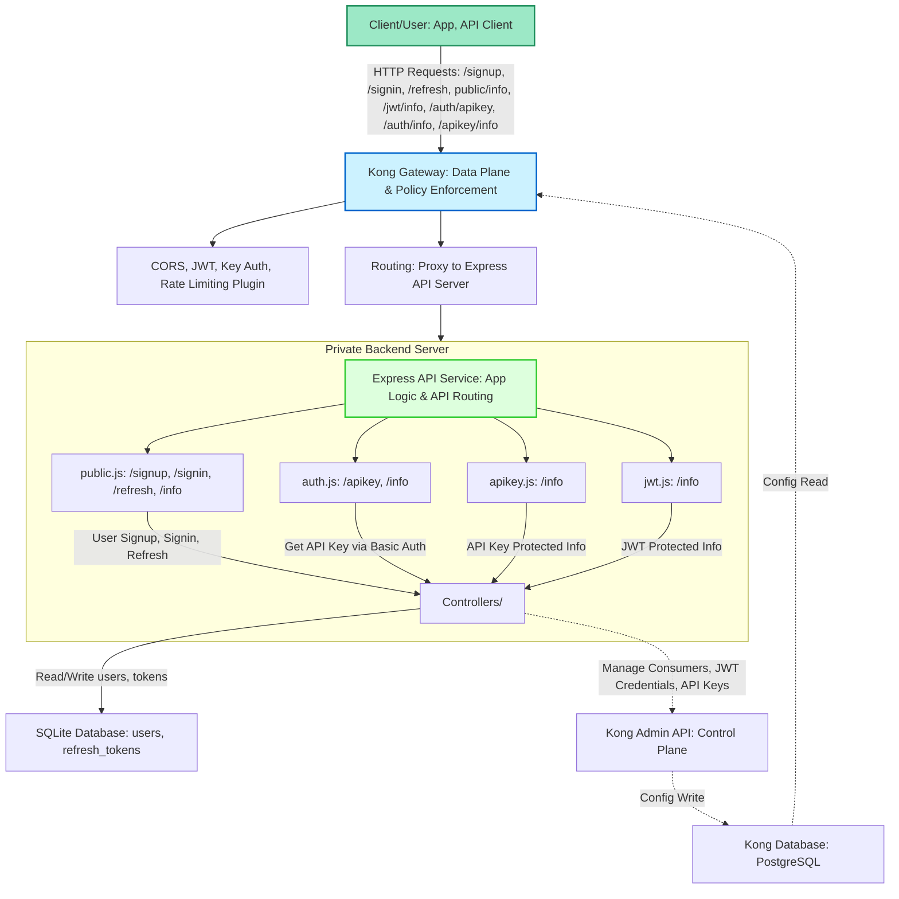

**Chú thích:**
- **Data Plane** (luồng dữ liệu runtime): Client → Kong Gateway (áp dụng policy, xác thực, routing) → Express API Server (thực thi nghiệp vụ, lưu dữ liệu) → SQLite → trả kết quả về cho Client.
- **Control Plane** (quản trị cấu hình): Express API Server tự động gọi Kong Admin API để tạo consumer, cấp JWT credential, cấp API Key...; Kong Admin API ghi cấu hình vào Kong Database (Postgres); Kong Gateway đọc cấu hình này để enforce policy.
- **Các plugin bảo mật** được gắn tại Kong Gateway (CORS, JWT, Key Auth, Rate Limiting).
- **Routing** của Express phân chia rõ các nghiệp vụ (public, jwt, key, auth).

---
