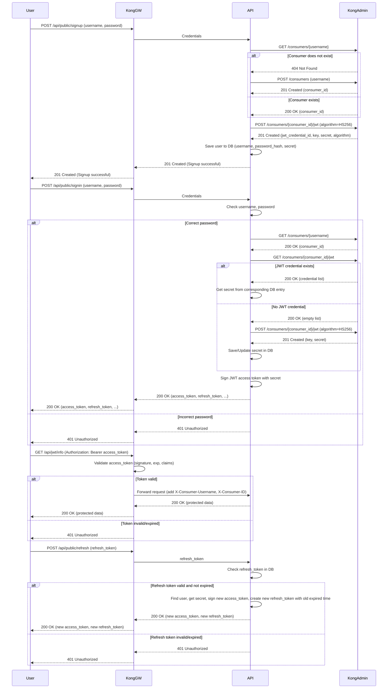

```mermaid
sequenceDiagram
    participant User
    participant KongGW
    participant API
    participant KongAdmin

    User->>KongGW: POST /api/public/signup (username, password)
    KongGW->>API: Credentials
    API->>KongAdmin: GET /consumers/{username}
    alt Consumer does not exist
        KongAdmin-->>API: 404 Not Found
        API->>KongAdmin: POST /consumers (username)
        KongAdmin-->>API: 201 Created (consumer_id)
    else Consumer exists
        KongAdmin-->>API: 200 OK (consumer_id)
    end
    API->>KongAdmin: POST /consumers/{consumer_id}/jwt (algorithm=HS256)
    KongAdmin-->>API: 201 Created (jwt_credential_id, key, secret, algorithm)
    API->>API: Save user to DB (username, password_hash, secret)
    API-->>KongGW: 201 Created (Signup successful)
    KongGW-->>User: 201 Created (Signup successful)

    User->>KongGW: POST /api/public/signin (username, password)
    KongGW->>API: Credentials
    API->>API: Check username, password
    alt Correct password
        API->>KongAdmin: GET /consumers/{username}
        KongAdmin-->>API: 200 OK (consumer_id)
        API->>KongAdmin: GET /consumers/{consumer_id}/jwt
        alt JWT credential exists
            KongAdmin-->>API: 200 OK (credential list)
            API->>API: Get secret from corresponding DB entry
        else No JWT credential
            KongAdmin-->>API: 200 OK (empty list)
            API->>KongAdmin: POST /consumers/{consumer_id}/jwt (algorithm=HS256)
            KongAdmin-->>API: 201 Created (key, secret)
            API->>API: Save/Update secret in DB
        end
        API->>API: Sign JWT access token with secret
        API-->>KongGW: 200 OK (access_token, refresh_token, ...)
        KongGW-->>User: 200 OK (access_token, refresh_token, ...)
    else Incorrect password
        API-->>KongGW: 401 Unauthorized
        KongGW-->>User: 401 Unauthorized
    end

    User->>KongGW: GET /api/jwt/info (Authorization: Bearer access_token)
    KongGW->>KongGW: Validate access_token (signature, exp, claims)
    alt Token valid
        KongGW->>API: Forward request (add X-Consumer-Username, X-Consumer-ID)
        API-->>KongGW: 200 OK (protected data)
        KongGW-->>User: 200 OK (protected data)
    else Token invalid/expired
        KongGW-->>User: 401 Unauthorized
    end
    User->>KongGW: POST /api/public/refresh (refresh_token)
    KongGW->>API: refresh_token
    API->>API: Check refresh_token in DB
    alt Refresh token valid and not expired
        API->>API: Find user, get secret, sign new access_token, create new refresh_token with old expired time
        API-->>KongGW: 200 OK (new access_token, new refresh_token)
        KongGW-->>User: 200 OK (new access_token, new refresh_token)
    else Refresh token invalid/expired
        API-->>KongGW: 401 Unauthorized
        KongGW-->>User: 401 Unauthorized
    end
```